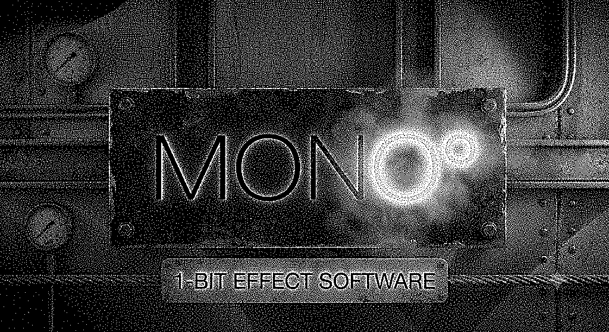
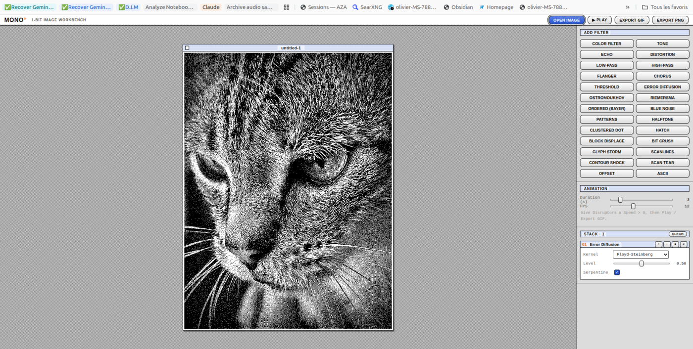
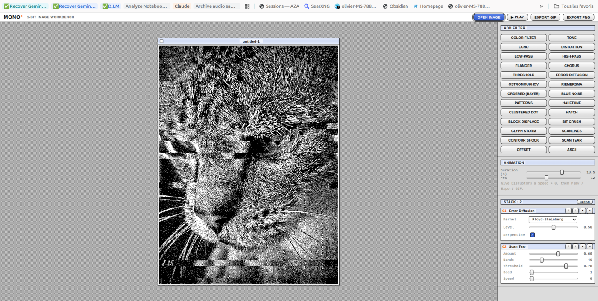
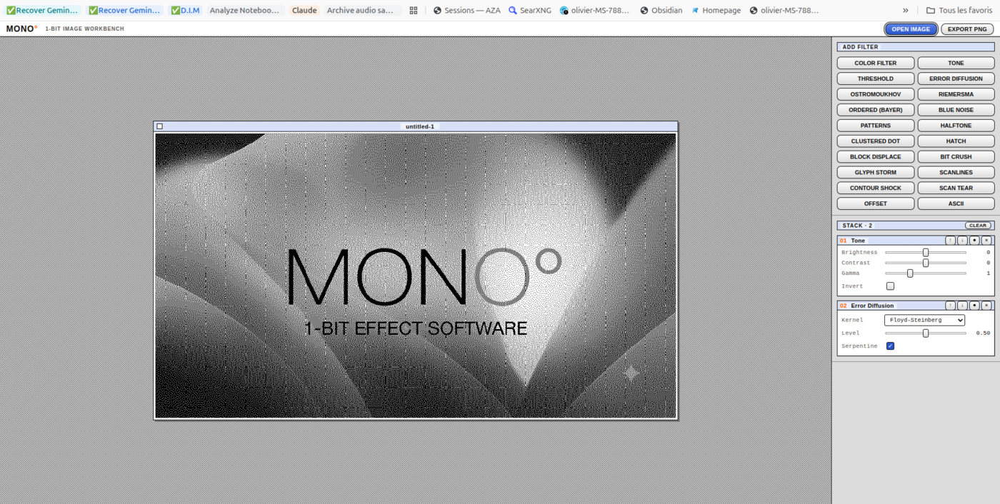

<p align="center">
  
</p>

# MONO°

**An industrial 1-bit black & white image workbench.** Drop in a photo, stack screens and
dithers, and pull out crisp monochrome art. Built for zines, risograph/offset prep, and the
pure MacPaint aesthetic.

Black & white only, by design. The interface is grayscale with a single restrained orange accent.

### ▶ [Try it live — obareau.github.io/mono](https://obareau.github.io/mono/)


<p align="center">
  
</p>
<p align="center">
  
  
</p>

## Filters

| Filter | What it does |
|--------|--------------|
| **Color Filter** | B&W photographic filters (red/orange/yellow/green/blue) — re-derives gray from source RGB, like coloured glass on the lens |
| **Tone** | Brightness / contrast / gamma / invert — prep before screening |
| **Threshold** | Hard 1-bit cut |
| **Error Diffusion** | Floyd-Steinberg, Atkinson, Jarvis-Judice-Ninke, Stucki, Burkes, Sierra, Sierra Lite, Stevenson-Arce — serpentine scan |
| **Ostromoukhov** | Variable-coefficient error diffusion (SIGGRAPH 2001) — near blue-noise, artefact-free |
| **Riemersma** | Error diffusion along a Hilbert curve — isotropic, scanline-free grain |
| **Ordered (Bayer)** | 2/4/8 matrix screens — the structured paint-program look |
| **Blue Noise** | Void-and-cluster FM screen — fine organic grain, no pattern |
| **Patterns** | MacPaint-style 8×8 fill tiles, tone-mapped or single-tile |
| **Halftone** | Rotated dot / square / line screen — offset print "trame" (SVG/PDF export) |
| **Clustered Dot** | AM halftone screen locked to the pixel grid — growing press dots (SVG/PDF export) |
| **Stipple** | Ink dots, size- or density-modulated by tone — clean SVG/PDF export |
| **Hatch** | Lines / crosshatch / spiral screens, tone-driven thickness |
| **Contour** | Topographic iso-luminance lines, optional band shading |
| **Signal FX** | Image-as-signal: Echo, Distortion, Low-Pass, High-Pass, Flanger, Chorus |
| **Geometry** | Pixel Mosaic, Adaptive Mosaic (cells by luminance), Triangulation (low-poly), Tessellation (hex), Voronoi |
| **Disruptors** | Block Displace, Bit Crush, Glyph Storm, Scanlines, Contour Shock, Scan Tear — glitch effects ported from the [terminal-synth](https://github.com/obareau/terminal-synth) VJ tool |
| **Offset** | Misregistration ghosting + sliced scan-shift glitch |
| **ASCII** | Text-mode rendering — **type the character ramp yourself**, export `.txt` |

> MONO° is a **still-image** workbench. For motion (animation, video, GIF) the companion
> tool [terminal-synth](https://github.com/obareau/terminal-synth) imports photos, videos and
> GIFs and shares the same disruptor vocabulary.

Filters apply **top to bottom** as a stack: reorder, toggle, and tweak each one live.
Adding a new filter is one file + one registry line — controls are generated from the
filter's declared parameters.

## Run it

```bash
npm install
npm run dev
```

Then drop, paste, or open an image.

- **EXPORT PNG** re-runs the stack at the source's native resolution.
- **EXPORT SVG / PDF** appear when a vector-capable screen (Halftone, Clustered Dot, Stipple)
  is in the stack — resolution-independent dots for print.
- **COPY LINK** shares the whole filter stack via a URL.
- ASCII is a *terminal* filter: it renders its own glyph grid and exports `.txt`.

## Architecture

See [ARCHITECTURE.md](./ARCHITECTURE.md). In short: `source image → grayscale buffer →
[filter stack] → output`. Filters are pure transforms on a `Float32Array` (values 0..1);
error-diffusion is intentionally CPU/sequential, screens are per-pixel and GPU-ready for later.

## Roadmap

See [ROADMAP.md](./ROADMAP.md). Near-term: live deploy, full-resolution export, and
shareable stack presets; then vector (SVG/PDF) export and a WebGL2/worker performance pass.

## License

MIT
